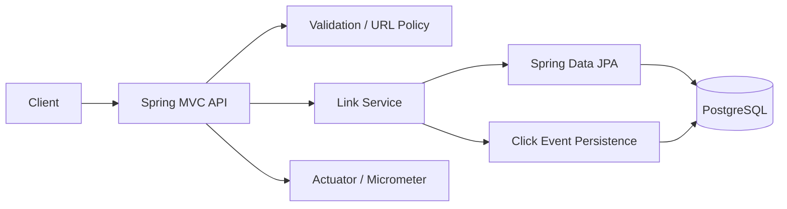

# Architecture Overview

## Goals

The design prioritizes correctness, testability, safe change, and a clear path to scale. It deliberately avoids infrastructure that is unnecessary for a 2–3 day prototype while recording where production architecture would diverge.

## Components

### Request flows

**Create:** validate request → normalize URL → validate/reserve alias → allocate generated/custom code → persist → return `201`.

**Redirect:** load link → verify active/not expired → atomically increment count with guarded SQL update → persist click event → return `302 Location`.

**Deactivate:** load link → mark `INACTIVE` → subsequent redirect returns `410 Gone`.

**Analytics:** load link → return aggregate counters + up to 100 recent click records.

## Key decisions

1. **Java 17:** enterprise-friendly LTS baseline requested for the exercise.
2. **Spring Boot 3.5.x:** mature Java-17-compatible Spring generation, minimizing unnecessary migration risk while retaining current framework capabilities.
3. **PostgreSQL:** durable relational state, uniqueness enforcement, transactional updates, production familiarity.
4. **Flyway:** schema is version-controlled and repeatable; Hibernate uses `validate` in production.
5. **Atomic click increment:** avoids lost updates under concurrent redirects.
6. **No redirect cache in this prototype:** a naïve cache can return an expired or deactivated target. A production cache should carry version/expiry metadata and use event-driven invalidation or short bounded TTL with correctness checks.
7. **302 redirect:** conservative default because target behavior may change; permanent redirects can be cached aggressively by clients.
8. **No IP analytics retention:** lowers privacy exposure; referrer and user-agent are truncated to bounded sizes.
9. **No authentication in prototype:** assignment focuses on engineering execution. Production management/analytics endpoints require authorization and tenant ownership.

## Scaling path

At higher traffic:

- Put redirect reads behind Redis or another distributed cache with explicit invalidation/versioning.
- Move click events to Kafka and asynchronously aggregate into an analytics store.
- Keep PostgreSQL as link source-of-truth, partition or shard by code/hash if required.
- Replace JVM-local rate limiting with gateway/Redis distributed limiting.
- Add OpenTelemetry traces and centralized logs.
- Add authentication/authorization for create, analytics, and deactivate operations.
- Run load tests around redirect latency and hot-key behavior before capacity commitments.
